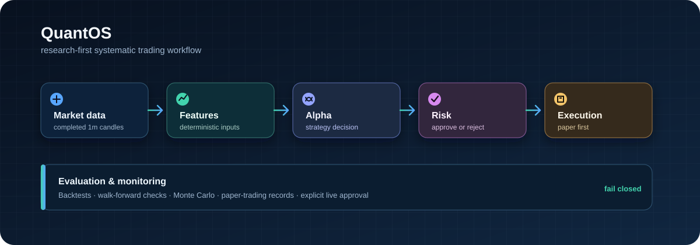

# QuantOS

  

  A local quantitative trading research system for building, testing, and validating systematic Binance Spot strategies.

> **Research and paper trading first.** QuantOS does not claim profitability and is not live-approved.

## What is QuantOS?

QuantOS is a Python project for taking a strategy from market data to backtesting and paper trading without mixing up research, risk, and execution concerns.

The V1 mainline is intentionally focused: Binance Spot, BTCUSDT and ETHUSDT, completed one-minute candles, one strategy, one model, and a paper-first workflow. The goal is a small system that is understandable, reproducible, and safe to work on.

## Where the project is now

| Area | Current state |
|---|---|
| Main branch | Frozen Spot-only V1 baseline |
| Market data | Historical and live candle handling, validation, Parquet storage, and DuckDB queries |
| Research | Deterministic features, causal training data, temporal splits, and model artifacts |
| Evaluation | Backtesting, costs, performance metrics, walk-forward checks, and Monte Carlo support |
| Runtime | Risk-controlled paper execution and a continuous paper-runtime path |
| Live trading | Not approved; explicit promotion and human approval are required |

Research results and paper runs are evidence to review, not proof of future performance.

## How it works

QuantOS keeps the core trading loop simple:

~~~text
Market data → features → strategy decision → risk checks → execution
                          ↘
                    evaluation and records
~~~

The project has six production modules: Market Data, Feature Engine, Alpha Engine, Risk Engine, Execution Engine, and Evaluation Engine. Storage, configuration, logging, adapters, and the CLI support those modules without becoming separate product systems.

## Research → validation → execution

~~~text
Research → Backtest → Walk-Forward → Monte Carlo → Paper Trading → Live Approval
~~~

Each step is a gate. A promising backtest or paper run does not automatically authorize live trading.

## What's implemented

- Binance Spot historical and live completed-candle data paths for BTCUSDT and ETHUSDT.
- Immutable Parquet datasets with local DuckDB queries.
- Deterministic feature generation shared by research and runtime paths.
- Causal labels, chronological data splits, and reproducible LightGBM model artifacts.
- Event-driven backtests with fees, slippage, fills, account state, and performance metrics.
- Risk checks for position sizing, exposure, loss limits, drawdown, stale data, and expected costs.
- Paper execution, runtime state, structured logs, and fail-closed handling for uncertain state.

## Futures / HFT research

Futures and HFT work is preserved on separate experimental branches. It is not part of the frozen Spot-only V1 mainline and is not evidence of profitable live trading.

- codex/v1-autonomous-futures-mvp includes Binance USDⓈ-M connectivity; L2, bookTicker, trade, mark, and funding inputs; VAMP, microprice, order-book imbalance, and signed aggressive flow; maker-first/post-only research; queue-aware paper fills; latency/liveness monitoring; authenticated preflight; and Edge V2 research.
- codex/v1-f3-carry-risk-overlay contains Futures carry-risk research.
- codex/v1-t5-aggressive-alpha contains separate experimental alpha work pending specification review.

## Quick start

QuantOS requires Python 3.11 or later.

~~~bash
git clone https://github.com/BaileyVu/QuantOS.git
cd QuantOS
python3 -m venv .venv
source .venv/bin/activate
python -m pip install -e .
python -m unittest tests.validation.test_architecture
~~~

On Windows PowerShell:

~~~powershell
.\.venv\Scripts\Activate.ps1
~~~

To see available local commands:

~~~bash
python -m quantos --help
~~~

## Project structure

~~~text
QuantOS/
├── src/quantos/   # Domain rules, application flow, adapters, and CLI
├── tests/         # Unit, integration, and architecture checks
├── configs/       # Safe example and paper-runtime configuration
├── docs/          # Frozen V1 specifications and research records
├── research/      # Research programs and evidence
└── README.md
~~~

## Safety

- Start with research, validation, and paper trading.
- Risk is evaluated before execution, and a risk rejection is final.
- Only the Execution module may submit an exchange order.
- Missing, stale, invalid, or unreconciled state stops the affected action.
- Mainnet access requires explicit authorization and safeguards.

## Data & secrets

Market datasets, generated artifacts, and credentials stay outside Git. Common local locations are:

~~~text
QuantOS-Data
QuantOS-HFT-Data
QuantOS-Secrets
~~~

Never commit API keys, .env files, account information, raw datasets, or generated trading artifacts.

## Documentation

Start with [AGENTS.md](AGENTS.md), then read [docs/000_READ_FIRST.md](docs/000_READ_FIRST.md) and the relevant frozen V1 specification. The documentation is the source of truth for architecture, trading behavior, and promotion rules.

## License

QuantOS is distributed under the [repository license](LICENSE).
